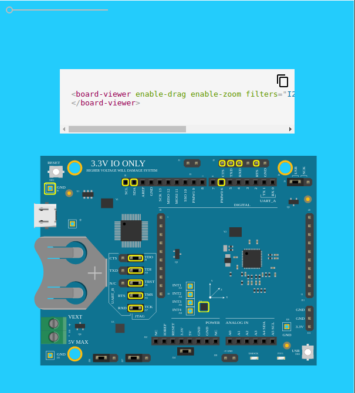

DISCONTINUATION OF PROJECT. 

This project will no longer be maintained by Intel.

This project has been identified as having known security escapes.

Intel has ceased development and contributions including, but not limited to, maintenance, bug fixes, new releases, or updates, to this project.  

Intel no longer accepts patches to this project.
# \<board-viewer\>




Interactive hardware board viewer. [Live 
demo](https://board-explorer.github.io/board-viewer/components/board-viewer/)

## Install the Polymer-CLI

First, make sure you have the [Polymer 
CLI](https://www.npmjs.com/package/polymer-cli) installed. Then run `polymer 
serve` to serve your element locally.

## Viewing Your Element

```bash
polymer serve
```

## Running Tests

```bash
polymer test
```

Your application is already set up to be tested via 
[web-component-tester](https://github.com/Polymer/web-component-tester). Run 
`polymer test` to run your application's test suite locally.
